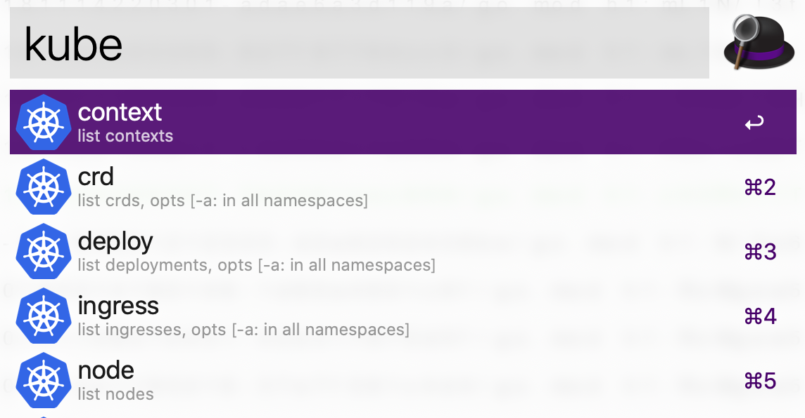

## alfred k8s (Kubernetes)
Alfred Workflow to operate k8s resources.


## Features
- Lists k8s resources and copies to clipboard (e.g. pod. deployment, ingress etc..).
- Switch Context/Namespace


## Install
Download the workflow form [latest release](https://github.com/konoui/alfred-k8s/releases).


## Usage
Kyeword is `kube`.



### List resources in current namespace
Please type `kube <resource-name>`.  
e.g.) `kube pod`

### List resources in all namespaces
Please add `-a` option.  
e.g.) `kube pod -a`

### List specific resources
`kube obj <resource-name>` is for other resources not supported.  
For example, you can list replicaset resources by `kube obj rs` as the workflow does not support `kube rs`.

### Switch Context/Namespace
Please type `kube context` or `kube ns`

|  Key Combination  |  Action  |
| ---- | ---- |
| `enter` | Copy to clipboard |
|  `control` + `enter`  |  Switch context/namespace  |


## Configuration
The workflow will try to use `/usr/local/bin/kubectl` by default.  
When your kube config has [client-go credential plugins](https://kubernetes.io/docs/reference/access-authn-authz/authentication/#client-go-credential-plugins) command as relative path, the workflow will search `/usr/local/bin/` path.

If you change above default values, please create configuration file as `.alfred-k8s` in home directory (~/).  
e.g.) `aws` command for EKS exists in `${HOME}/.pyenv/shims/`.
```yaml
kubectl:
    kubectl_absolute_path: "/usr/local/bin/kubectl"
    plugin_paths:
    - "/usr/local/bin/"
    - "${HOME}/.pyenv/shims/"
```
